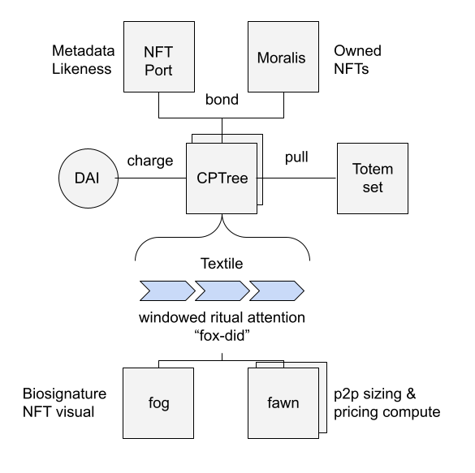

# 🌳 ArBr ⚙️

terraform APIs for 1/1 Earth. have your computer. use the door.


## background
let this be a queued-up snapshot into current progress of this project for where things are at and where things are going as entrance into the Ethonline hackathon. The overstory behind the project is long, but meaningful to me via [deep6.org](deep6.org). it began with a few coherence points in software alchemical ideation in the various ethereum global events.
* [gov10](https://youtu.be/_YaIWFzAqbg) was a land based phenomonen meant to unit people around shared bioregional clusters using money markets. 
* [m2m](https://www.youtube.com/watch?v=SY_ZUN1geeQ) was a personal generator function for bci interface data where AI models are stored locally first, to be used by other [activities](https://youtu.be/uozM-vpuBUs). 
* [eth(OS)tep](https://youtu.be/0ldbJx85HbA?t=61) is a collective hastas ritual physical clock looking that aims to solve climate as a data flow problem. 

all these projects will converge on the arbr protocol in a simplified smart contract implementation, with a prime focus on eth(OS)tep.

Technologies used: hands, ritual, ethereum, polygon, charged particles, filecoin, fluence network

## user stories:

* *Physical Analog*: As a user, I want to be able to take a walk to a tree, login via geocache or wood embedding, and contribute resources to further organize value to similiar trees.
* *Digital Metaverse*: As a user, I want to be able to choose from a list of tree totems with NFTs embedded in the signature, and accrue interest with instituional resources matching interest rates to scalable carbon sequestration projects via a cognitioners attention.

## progress (todo)
- Designs 
- Modules (NFTPort)
- Interface points
- Schema Design

### architecture


### choose totem / tree


### charge trunk


### inspect totem likeness & project


### entity component system (ECS)
under certain implementation patterns in video games, the project aims to follow suit in the fashion of considering our global sphere as game-like map of browsing. as a prospective & local solarpunk city advocate in the community planning space, I view cities as the first browsers that increased our collective intelligence. The more I continue, the more I realize arbr is a useful curating tool for auction house referral mechanisms around a steersmans game that we can play in the metaverse, involving such loot based curating, like creating eagle-eye like precision of the stories we tell each other when constructing and implanting the feinance like art in the supply chain of sacred objects like wood.

#### *Fog*
Textile caching service & bio-signature local aggregating service. Can be thought of as the whymsical mist on the forest floor that comes, goes, and feeds the landscape, as those that explore the forest remap climate attention flow to various memes.

Totem Symbolism : 1. Illusion vs Reality. Fog symbolism is often used as a symbol that's stuck somewhere between reality and illusion. 2. Uncertainty. Driving in fog can be dangerous because we're not sure what lies only a few meters in front of us. 3. Mystery.

```
“The fog comes
on little cat feet
it sits looking
and then moves on”

— Carl Sandburg
```


#### *Fox*
the Ceramic Identity service that holds the DID and tree graph of spirit totems mapped to charged particles.

Totem Symbolism : “Nearly every culture regards Fox symbolism as including stealthy, near-silent movement because the creature is so well-acclimated to the space it inhabits. Immediately, Fox represents slyness, elusiveness, the mysterious, and adaptability.”

'Ideal' Galactic Tree Steward entry point as the central point of DID registry for signing into a tree, uses the Fox composition.


#### *Faun*
the measurement service implemented to record the file size calculations. As seen as the similar abstraction to the side-car IPFS nodes, these mythical creatures / services push data & make recordings across the network.

Totem Symbolism : Rustic music twines through the tree branches of ancient Greece, the kind of music that makes men forget their worries and women fall in love. Fauns pipe this music through the trees, and they are just as carefree and romantic as their own songs. The Faun is a representation of grace, beauty, essence, and illumination. You are being requested to follow the wisdom of yourself and continue forward.


#### *Arbr*
The underlying protocol of the forest, that interacts with the charged particle ecosystem representing the molecular memetic genes that will accrue value.

These various abstractions based on their shape live in various computing tools, representing the contextual shape of Things & services in the ecosystem. The meme + Arbor + memory can be though of a memeory. As the tooling assist moves up the track, the higher intelligence-like entities are formed.

## reflections on project: 

I’ve always wanted to roll the stake of hackathons forward not just with presence or financial, but also composable pieces that might fit together with pieces along the way. Working on this. Allow the affordances of storytelling to merge via this critical artwork.

Always looking for more developer help on this adventure, together.

with love

🌰💚🦋
